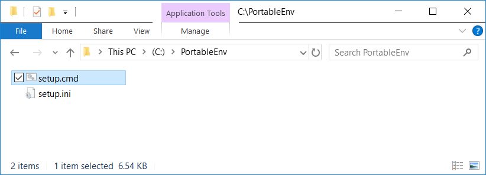
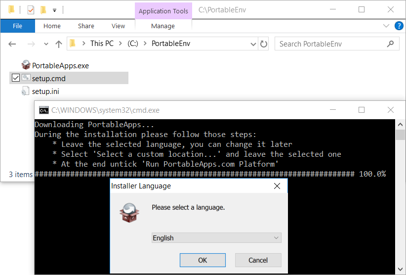
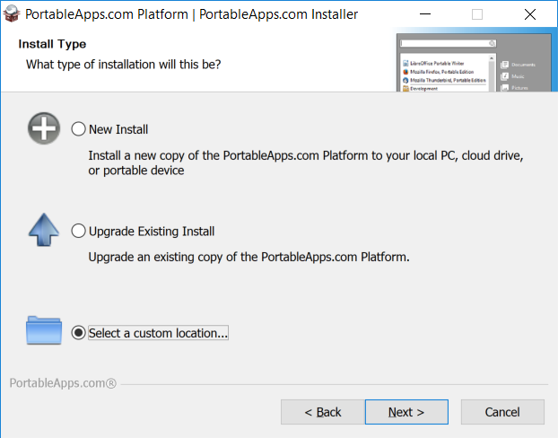
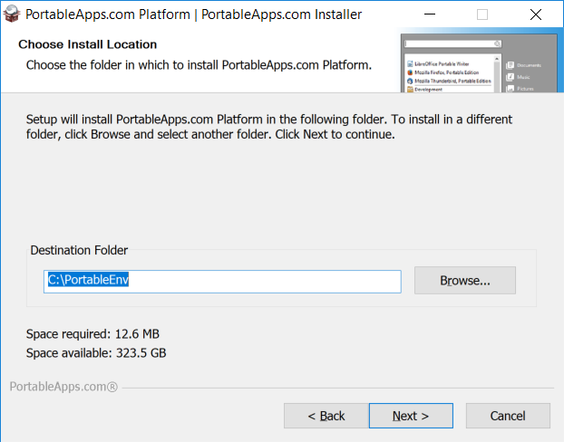
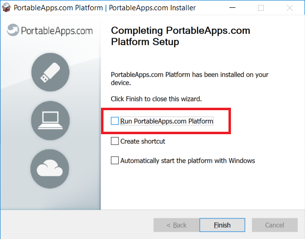
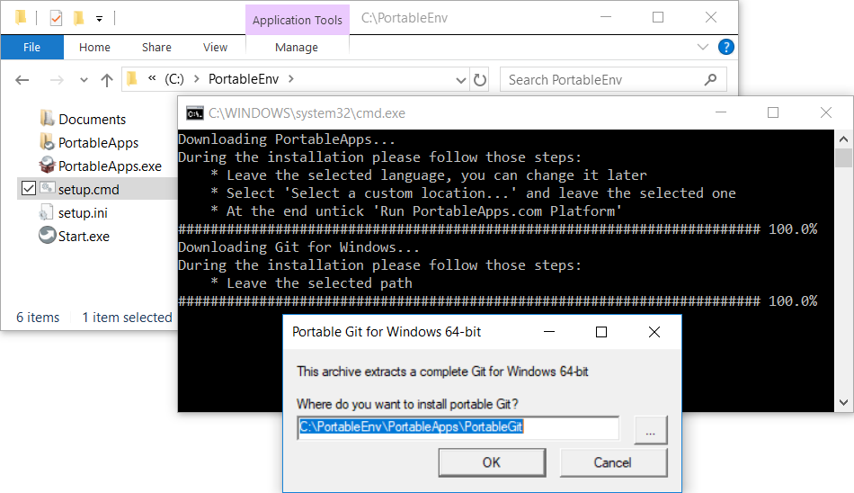
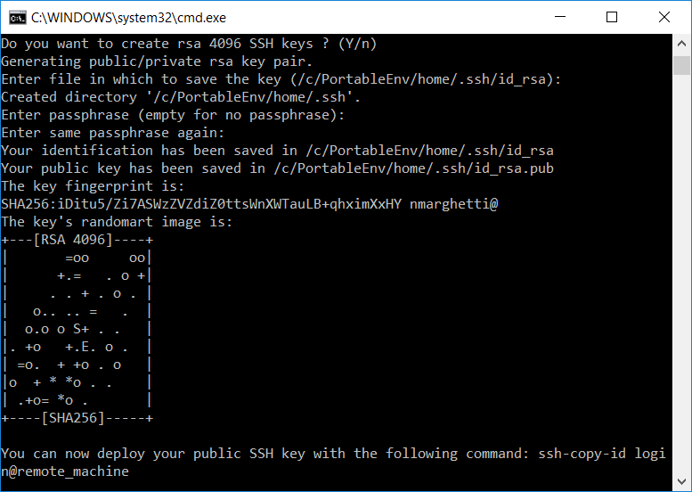
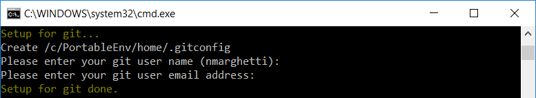
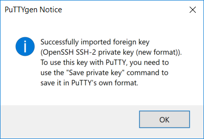
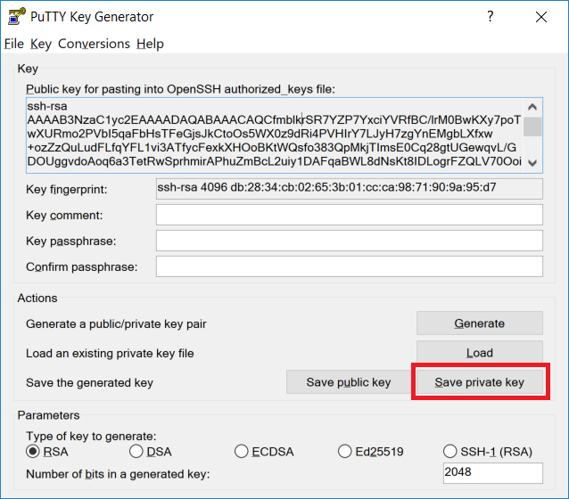

# Setup

---

- [Steps](#steps)
- [Installation](#installation)
- [Known installation issues](#known-installation-issues)

---

## **Steps**

Here are the steps to follow during the installation.

1. PortableApps
   - Press OK for language selection (you can change it later)
   - Press Next and Agree
   - Select radio button "Select a custom location..." and press Next
   - Do not change "Destination Folder" and press Next and Install
   - **_!!! Untick "Run PortableApps Platform" and press Finish !!!_**
1. Git for Windows
   - Do not change the destination and press OK
   - It will ask you to generate rsa 4096 SSH keys if you want
1. Git config
   - Enter your user name and email address

You should end up with a folder structure as follow:

```text
C:\PortableEnv
├── Documents
├── PortableApps
├── Start.exe
└── home
```

You can launch Start.exe to start PortableApps. From there you will be able to run Git bash terminal, the user's HOME would be the home folder above.

## **Installation**

1. Download [**setup.cmd**](https://raw.githubusercontent.com/nmarghetti/common_env/master/tools/setup.cmd) and [setup.ini](https://raw.githubusercontent.com/nmarghetti/common_env/master/tools/setup.ini) (Right click -> "Save Link As...") into a folder preferably with no space (eg. "C:\PortableEnv") and execute setup.cmd

   

1. Do not change language, press OK

   

1. Select a custom location...

   

1. Do not change the destination folder, press Next

   

1. Untick "Run PortableApps.com Platform"

   

1. For Git for Windows install, leave the path, just press OK

   

1. When it asks you to generate SSH keys, just press Enter several times

   

1. When asked, you can put your git user name and email

   

1. Run Start.exe

   

1. Run Start.exe

   You get those configured applications and you can get more with the "Apps" button on the right.

   

## **Known installation issues**

1. Your computer does not have wget nor curl installed

   In that case you can manually download [64-bit wget 1.20.3](https://eternallybored.org/misc/wget/1.20.3/64/wget.exe) and start again the installation. Your folder shoud look like that:

   ```text
     C:/PortableEnv
     ├── setup.cmd
     └── setup.ini
     └── wget.exe
   ```

1. Error during download (eg. 'unable to get local issuer certificate')

   In that case you can manually download [PortableApps 16.1.1](https://portableapps.com/downloading/?a=PortableApps.comPlatform&s=s&d=pa&n=The%20PortableApps.com%20Platform&f=PortableApps.com_Platform_Setup_16.1.1.paf.exe) and [64-bit Git for Windows Portable 2.2.26](https://github.com/git-for-windows/git/releases/download/v2.26.0.windows.1/PortableGit-2.26.0-64-bit.7z.exe) and start again the installation. Notice that you should save the files as follow:

   ```text
     C:/PortableEnv
     ├── PortableApps.exe
     ├── PortableGit.exe
     ├── setup.cmd
     └── setup.ini
   ```
