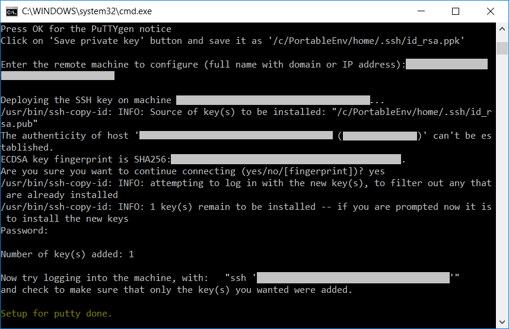

# **Setup**

---

<!-- TOC depthFrom:2 -->

- [**Steps**](#steps)
- [**Installation**](#installation)
- [**Custom VSCode settings**](#custom-vscode-settings)
- [**Known installation issues**](#known-installation-issues)

<!-- /TOC -->

---

## **Steps**

Here are the steps to follow during the installation.

1. PortableApps
   - Press OK for language selection (you can change it later)
   - Press Next and Agree
   - Select radio button "Select a custom location..." and press Next
   - Do not change "Destination Folder" and press Next and Install
   - **_!!! Untick "Run PortableApps Platform" and press Finish !!!_**
1. Git for Windows
   - Do not change the destination and press OK
   - It will ask you to generate rsa 4096 SSH keys if you want
1. Git config
   - Enter your user name and email address

You should end up with a folder structure as follow:

<!--

-->


You can launch Start.exe to start PortableApps. From there you will be able to run Git bash terminal, the user's HOME would be the home folder above.

## **Installation**

1. Download [**setup.cmd**](https://raw.githubusercontent.com/nmarghetti/common_env/master/tools/setup.cmd) and [setup.ini](https://raw.githubusercontent.com/nmarghetti/common_env/master/tools/setup.ini) (Right click -> "Save Link As...")

   Save them into a folder preferably with no space (eg. "C:\PortableEnv").\
    You can edit setup.ini to select what you want to install.\
    Execute setup.cmd.

   

1. Do not change language, press OK

   

1. Select a custom location...

   

1. Do not change the destination folder, press Next

   

1. Untick "Run PortableApps.com Platform"

   

1. For Git for Windows install, leave the path, just press OK if it asks

   

1. When it asks you to generate SSH keys, just press Enter several times

   

1. When asked, you can put your git user name and email

   

1. Export yout SSH key to PuTTY format

   - Press OK for the "PuTTYgen Notice"

     

   - Press "Save private key" button and you can press "Yes" when asked to leave the passphrase empty

     

   - Ensure to save it as "C:\\PortableEnv\\home\\.ssh\\id_rsa.ppk"

     

   - Configure the connexion to a remote machine

     - Enter the name of the remote machine you want to configure and press Enter
     - Press "Yes" when it asks to allow modification with "Registry Editor"
     - Answer yes when it asks if you are sure you want to connect
     - Enter your password to connect to the remote machine

     

1. Run Start.exe

   

   You get those configured applications.

   

   You can get more with the "Apps" button on the right, then "Get More Apps..." and "By Category".

   

## **Custom VSCode settings**

You can override the default VSCode settings, extension settings and key bindings by adding `vscode_settings` folder inspired from this [folder](https://github.com/nmarghetti/common_env/tree/master/tools/vscode/settings).

```text
C:/PortableEnv
├── setup.cmd
├── setup.ini
└── vscode_settings
    ├── esbenp.prettier-vscode.json
    ├── foxundermoon.shell-format.json
    ├── keybindings.json
    └── settings.json
```

## **Known installation issues**

1. Your computer does not have wget nor curl installed

   In that case you can manually download [64-bit wget 1.20.3](https://eternallybored.org/misc/wget/1.20.3/64/wget.exe) and start again the installation. Your folder shoud look like that:

   ```text
     C:/PortableEnv
     ├── setup.cmd
     |── setup.ini
     └── wget.exe
   ```

1. Error during download (eg. 'unable to get local issuer certificate')

   In that case you can manually download [PortableApps 17.1.1](https://portableapps.com/downloading/?a=PortableApps.comPlatform&s=s&d=pa&n=The%20PortableApps.com%20Platform&f=PortableApps.com_Platform_Setup_17.1.1.paf.exe) and [64-bit Git for Windows Portable 2.30.0](https://github.com/git-for-windows/git/releases/download/v2.32.0.windows.1/PortableGit-2.32.0-64-bit.7z.exe) and start again the installation. Notice that you should save the files as follow:

   ```text
     C:/PortableEnv
     ├── PortableApps.exe
     ├── PortableGit.exe
     ├── setup.cmd
     └── setup.ini
   ```
